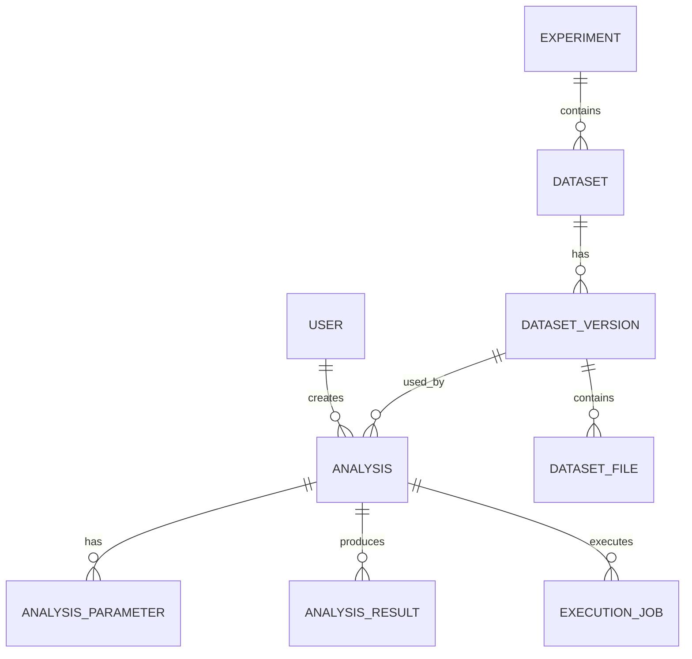

# OpenParticleLab Database Design

## 1. Database Purpose

The OpenParticleLab database stores application metadata required for dataset management, analysis execution, result tracking and reproducibility.

Large scientific datasets are not stored directly in MySQL.

---

## 2. Core Entities

The initial database contains the following conceptual entities:

* User
* Experiment
* Dataset
* DatasetVersion
* DatasetFile
* Analysis
* AnalysisParameter
* AnalysisResult
* ExecutionJob

---

## 3. Entity Relationships



---

## 4. User

Represents an OpenParticleLab application user.

Conceptual fields:

| Field      | Purpose                  |
| ---------- | ------------------------ |
| id         | Primary key              |
| username   | User identifier          |
| email      | User email               |
| password   | Securely stored password |
| created_at | Account creation time    |

Django's authentication system will be used rather than implementing password management manually.

---

## 5. Experiment

Represents a logical scientific investigation or collection of related analyses.

Conceptual fields:

| Field       | Purpose                         |
| ----------- | ------------------------------- |
| id          | Primary key                     |
| name        | Experiment name                 |
| description | Experiment description          |
| created_by  | User responsible for experiment |
| created_at  | Creation timestamp              |

An experiment may reference multiple datasets.

---

## 6. Dataset

Represents a logical scientific dataset.

Conceptual fields:

| Field        | Purpose                   |
| ------------ | ------------------------- |
| id           | Primary key               |
| experiment   | Related experiment        |
| name         | Dataset name              |
| description  | Dataset description       |
| source       | Scientific data source    |
| external_url | External dataset location |
| created_at   | Creation timestamp        |

A dataset can have multiple versions.

---

## 7. DatasetVersion

Represents a specific version of a dataset.

Conceptual fields:

| Field      | Purpose                       |
| ---------- | ----------------------------- |
| id         | Primary key                   |
| dataset    | Parent dataset                |
| version    | Version identifier            |
| checksum   | Optional integrity identifier |
| metadata   | Dataset metadata              |
| created_at | Version creation time         |

Analyses reference DatasetVersion rather than Dataset directly.

This is one of the central reproducibility decisions of the project.

---

## 8. DatasetFile

Represents a physical file belonging to a dataset version.

Conceptual fields:

| Field           | Purpose                |
| --------------- | ---------------------- |
| id              | Primary key            |
| dataset_version | Parent dataset version |
| filename        | File name              |
| file_size       | File size              |
| checksum        | File checksum          |
| format          | File format            |
| external_url    | External file location |

Large files remain external to the database.

---

## 9. Analysis

Represents a scientific computation requested or executed by a user.

Conceptual fields:

| Field            | Purpose                   |
| ---------------- | ------------------------- |
| id               | Primary key               |
| user             | User who created analysis |
| dataset_version  | Exact input dataset       |
| name             | Analysis name             |
| analysis_type    | Type of computation       |
| status           | Execution state           |
| software_version | OpenParticleLab version   |
| started_at       | Execution start           |
| completed_at     | Execution completion      |
| duration_seconds | Execution duration        |
| created_at       | Creation timestamp        |

---

## 10. AnalysisParameter

Stores configurable parameters associated with an analysis.

Conceptual fields:

| Field           | Purpose         |
| --------------- | --------------- |
| id              | Primary key     |
| analysis        | Parent analysis |
| parameter_name  | Parameter name  |
| parameter_value | Parameter value |

Keeping parameters separate makes it possible to introduce new analysis types without repeatedly changing the Analysis table.

---

## 11. AnalysisResult

Represents an output generated by an analysis.

Conceptual fields:

| Field        | Purpose                    |
| ------------ | -------------------------- |
| id           | Primary key                |
| analysis     | Parent analysis            |
| result_type  | Type of result             |
| result_data  | Small structured result    |
| artifact_url | External artifact location |
| created_at   | Creation timestamp         |

Small metadata and structured values may be stored in the database.

Large result files should remain external.

---

## 12. ExecutionJob

Represents execution information for an analysis.

Conceptual fields:

| Field         | Purpose             |
| ------------- | ------------------- |
| id            | Primary key         |
| analysis      | Related analysis    |
| status        | Job status          |
| worker_id     | Worker identifier   |
| started_at    | Start time          |
| completed_at  | Completion time     |
| error_message | Failure information |
| created_at    | Creation timestamp  |

This entity prepares the application for future Celery-based asynchronous execution.

---

## 13. Reproducibility Model

The minimum reproducibility chain is:

```text
Analysis
    |
    +-- DatasetVersion
    |       |
    |       +-- Dataset
    |       |
    |       +-- DatasetFile
    |
    +-- AnalysisParameters
    |
    +-- SoftwareVersion
    |
    +-- ExecutionJob
    |
    +-- AnalysisResults
```

An analysis should therefore contain enough information to answer:

1. What dataset was used?
2. Which version was used?
3. Which files were involved?
4. Which variables were selected?
5. Which filters were applied?
6. Which parameters were used?
7. Which software version executed the analysis?
8. When was it executed?
9. How long did it take?
10. What result was produced?

---

## 14. Database Principles

### Principle 1 — Metadata over raw data

MySQL stores metadata and application state, not large scientific datasets.

### Principle 2 — Explicit versions

Dataset versions are first-class entities.

### Principle 3 — Reproducibility

Analyses reference immutable or identifiable dataset versions.

### Principle 4 — Extensibility

Analysis parameters are stored independently from the analysis record.

### Principle 5 — Separation of concerns

Database models should not contain the complete scientific computation implementation.

### Principle 6 — External artifacts

Large scientific files and outputs are stored externally.

---

## 15. Initial Status Values

Analysis status:

```text
PENDING
RUNNING
COMPLETED
FAILED
CANCELLED
```

Execution job status:

```text
QUEUED
RUNNING
COMPLETED
FAILED
CANCELLED
```

These values may later be implemented using Django choices or dedicated enumerations.

---

## 16. Initial Analysis Types

The first release is expected to support:

```text
DESCRIPTIVE_STATISTICS
DISTRIBUTION
HISTOGRAM
CORRELATION
DATASET_COMPARISON
```

Additional analysis types can be added later.

---

## 17. Database Scope

The first implementation intentionally avoids unnecessary complexity.

Features such as:

* distributed execution
* advanced permissions
* dataset lineage graphs
* object-storage management
* experiment versioning

will be introduced only when justified by the project requirements.

